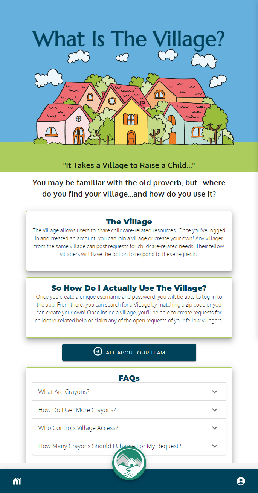
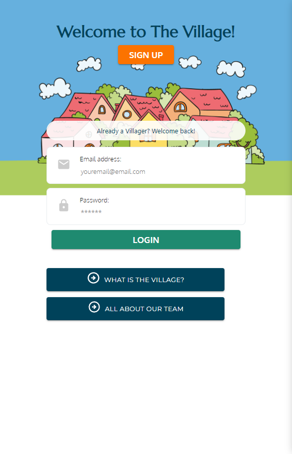
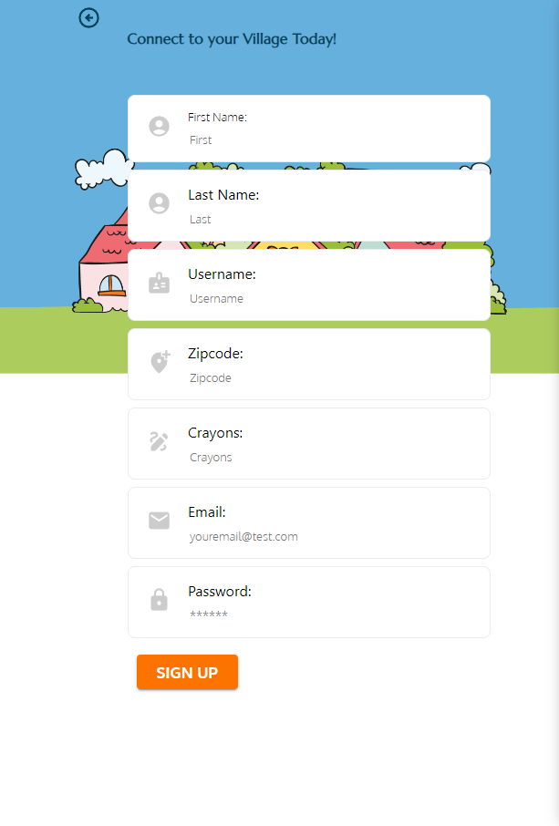
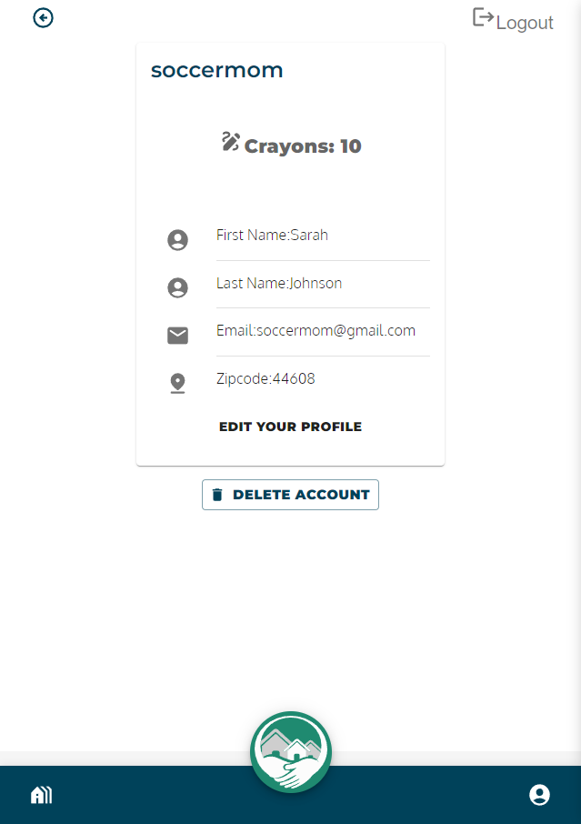
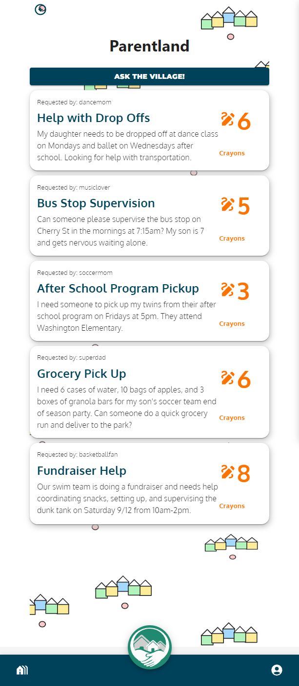
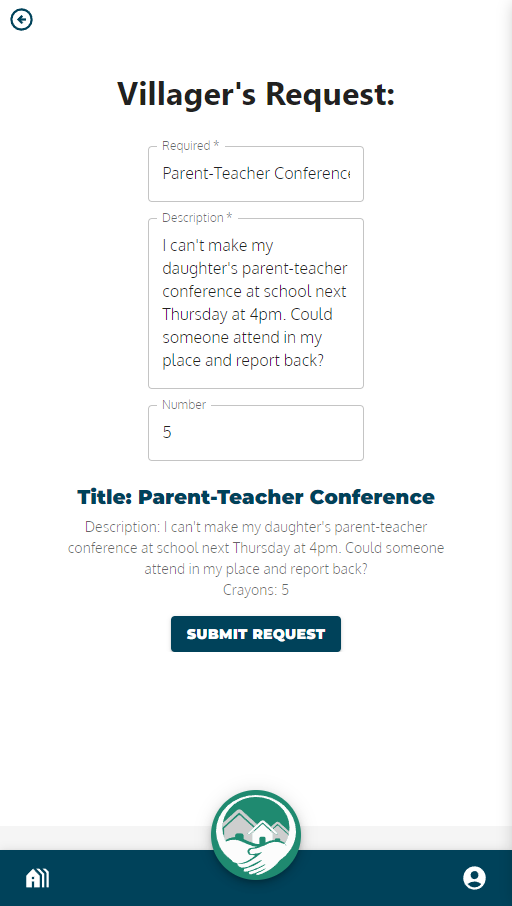

# The Village
>_It takes a village to raise a child._

You're likely familiar with this old proverb. And while many members of our modern society may have children, there are very, very few among us who have a village at our disposal. This is where _The Village_ app seeks to assist users.

## Description

Using _The Village_ app, users can create a private "village" or join a pre-existing village in their location by using their zip code. Users are granted "crayons" (the app's local form of currency) when they create a profile. These crayons can be used to trade for favors related to childcare with fellow villagers. 

### [>>Link to live application - deployed in Heroku](https://the-village-pr3-499485f65b78.herokuapp.com/)

For a detailed explanation of how to use the app, see the Usage section below. 

## Table of Contents

- [Installation](#installation)
- [Usage](#usage)
- [Technologies Used](#technologies-used)
- [Near Future Improvements](#near-future-improvements)
- [Future Version Improvements](#future-version-improvements)
- [Credits](#credits)
- [Art](#art)
- [License](#license)

## Installation

No installation is necessary to use The Village App right now. 

This application was designed with an emphasis on mobile-first, so ideally future versions will be downloadable. It is currently unavailable as a PWA and is not available through Google Play or the App Store. 

## Usage

Upon opening the app, users are greeted by a landing page that allows them to sign up, log in, or navigate to our "Team Member" and "What Is the Village" pages. 

### What is the Village
If a user navigates to this page, they will get a brief introduction to what The Village does and how they can access it. A short list of FAQs is accessible through a drop-down menu.

#### Team Member
When a user navigates to this page, they are greeted with a list of our contributing team members and a brief biography for each. 

### Log-In 

### Sign-Up

### Profile Page

Edit profile
Delete profile

### Village Home Page

### Villager's Request

More functionality is coming in future versions! 

## Technologies Used

### Back End

 

### Front End 

  

- [Slideshow presentation](https://www.canva.com/design/DAFuWZ87jNw/QFra1uHNmDWNgkdraLw61A/view?utm_content=DAFuWZ87jNw&utm_campaign=designshare&utm_medium=link&utm_source=publishsharelink)
- [Figma Mockup](https://www.figma.com/file/j5PmmiUv0WUYdM8C1grWte/Login-%2F-signup-%2F-profile-%2F?type=design&node-id=0-1&mode=design)
- [WireFrame](https://excalidraw.com/#json=GY7e7kdIy13utvEjPlK10,VBYFQH7GSuG4CyLG03kUiQ)

## Near Future Improvements

In the short time we had for this initial build, we were unable to include some of the basic functionality in the app that we had initially planned for our MVC release version. The top priority improvements for us will allow: 

- users to update their own password
- users to search for villages
- village administrators to delete their created village
- users to join an existing village
- users from a village to comment on a request in the village
- users to create a request
- users to claim a request posted by a fellow villager
- users to confirm completion of a request, thereby exchanging Crayons
- users to delete a request (which will delete the corresponding comments)

## Future Version Improvements

For future version releases, we have further goals and possibilities for the app. These include: 

- Providing a more detailed profile page which lists closed requests, open requests, and claimed requests belonging to the user
- Allowing users to search for villages geographically (or with other means than simply matching a zip code)
- Allowing village administrators to invite new villagers to join their village via external means (possibly through a passcode or email link)
- Permitting users to join more than one village
- Allowing users to select a profile image (or perhaps upload their own)
- A built-in chat/messaging service to allow villagers to communicate directly with one another
- A Crayon feed where users can see a history of their prior transactions

## Credits
The development team for _The Village_ app includes:
- [Annie McElroy](https://github.com/Annie-McElroy)
- [Dahlia Guido](https://github.com/CypherNyx)
- [Valerie Rojas](https://github.com/Valeriereds)
- [Lekendrick Mckeller](@https://github.com/KenMck92) 
- [Abe Omaits](https://github.com/aomaits) 

## Art 

- We created a mockup version of our app using [Figma](https://www.figma.com/) for prototyping navigation and UI. 

- Some images were also sourced from [Excalidraw](https://excalidraw.com/).

- Our developer profile avatars were created using [Avatar Maker](https://avatarmaker.com/).

- Additional clipart and images were sourced from [Freepick](https://www.freepik.com/).

## License
A [MIT license](https://github.com/Annie-McElroy/the-village/blob/main/LICENSE) was used for this project.
